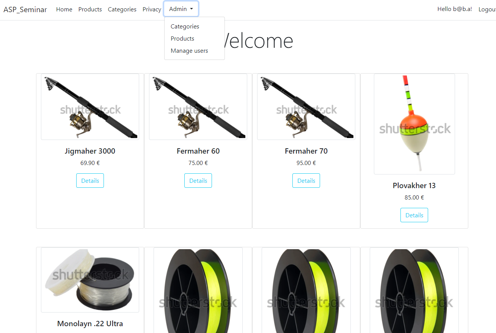

<br/>
<p align="center">
  <h3 align="center">ASP Seminar</h3>

  <p align="center">
    Seminarski rad za ASP MVC Algebra edukaciju
    <br/>
    <br/>
  </p>
</p>


## Table Of Contents

* [About the Project](#about-the-project)
* [Getting Started](#getting-started)
  * [Prerequisites](#prerequisites)
  * [Installation](#installation)
* [Api](#api)
* [License](#license)

## About The Project



Example project of a simple CMS based on ASP MVC .NET 6 with Entity Framework and Microsoft Identity.

## Getting Started

Visual Studio 2022 recommended, alternatively anything that can build a .net 6 visual studio project.

### Prerequisites

Microsoft SQL Server (Express)

### Installation

1. Edit the aspsettings.json, replacing SERVERHERE and DATABASEHERE with the server and database name respectively.

```json
"DefaultConnection": "Server=SERVERHERE;Database=DATABASEHERE;TrustServerCertificate=True;Integrated Security=True;"
```

2. Run the following commands in the package manager console:

```sh
add-migration init
update-database
```

3. Build and run the application

4. Default admin and password:
```
mail: b@b.a
pass: sifrica1
```

## API

Access the API endpoints at:

```
http://localhost:PORT/api/products
http://localhost:PORT/api/product/{id}
example: http://localhost:5056/api/product/5
```

## License

Distributed under the MIT License. See [LICENSE](https://github.com/zedor/ASPSeminar/blob/main/LICENSE.md) for more information.
